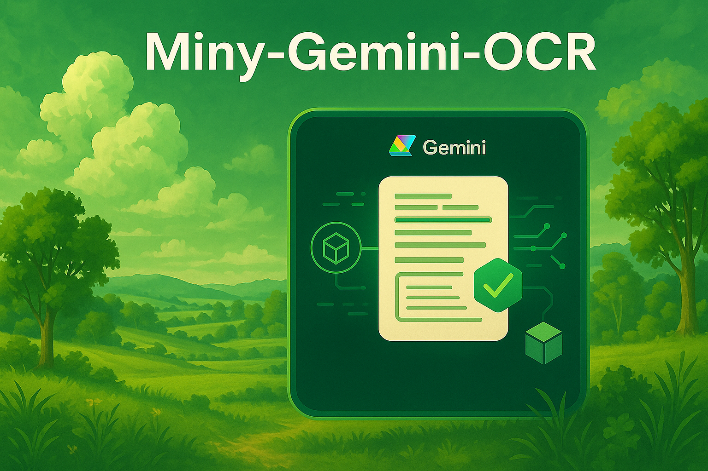
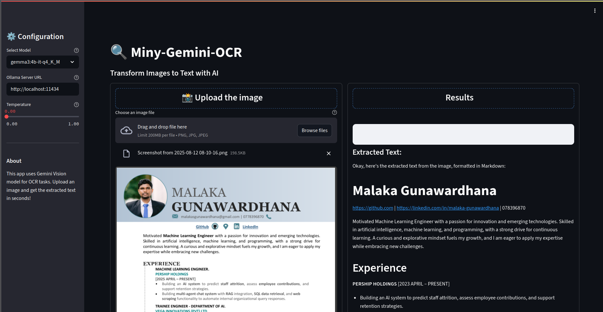

<div align="center">
  
</div>

<div align="center">
  <h1>Miny-Gemini-OCR</h1>
</div>

<div align="justify">
A Simple Guide to OCR (Optical Character Recognition) using the Gemma 3B Vision Language Model.

## Overview

<div align="justify">
This project demonstrates how to perform OCR on images using the Gemma 3:4B-it model through the Ollama server. It utilizes LangChain for orchestrating the OCR pipeline and provides a simple command-line interface for processing images.
</div>

## Features

- Uses Gemma 3:4B-it model for vision tasks
- Integrates with Ollama server for model serving
- Supports various image formats
- Outputs extracted text in Markdown format
- Configurable temperature for model responses

## Prerequisites

- Python 3.x
- Ollama server running locally
- Required Python packages:
  - langchain
  - langchain-ollama
  - Pillow (PIL)
  - Streamlit
  - typing

## Installation

1. Clone this repository:
```bash
git clone https://github.com/MalakaSupun/Miny-Gemini-OCR.git
cd Miny-Gemini-OCR
```

2. Ensure Ollama server is running locally on `http://localhost:11434`

## Usage

### CLI:
Run the OCR on an image using the following command:

```bash
python Main.py --input-image path/to/your/image.png
```

#### Optional Arguments

- `--model`: Specify the model name (default: "gemma3:4b-it-q4_K_M")
- `--base-url`: Set custom Ollama server URL (default: "http://localhost:11434")
- `--temperature`: Adjust model temperature (default: 0.0)

Example with all options:
```bash
python Main.py --input-image IMGs/IMG_01.png --model gemma3:4b-it-q4_K_M --base-url http://localhost:11434 --temperature 0.2
```
### GUI:

Run this command to open the streamlit OCR.
```
streamlit run streamlit_app.py 
```
#### Streamlit Application:

<div align="center">
  
</div>


## How It Works

<div align="justify">

1. **Image Processing**: 
   - The image is loaded using PIL (Python Imaging Library)
   - Converted to base64 format for model input
   
2. **OCR Chain**:
   - Uses LangChain to create a processing pipeline
   - The image is passed through a custom prompt template
   - Gemma 3:4B-it model processes the image and extracts text
   
3. **Output**:
   - Extracted text is returned in Markdown format
   - Results are printed to the console

</div>

## Project Structure

- `Main.py`: Entry point and CLI interface
- `Main_OCR.py`: Core OCR implementation using LangChain
- `My_Prompts.py`: Prompt templates for the vision model
- `IMGs/`: Directory containing sample images

## License

See the [LICENSE](LICENSE) file for details.

---